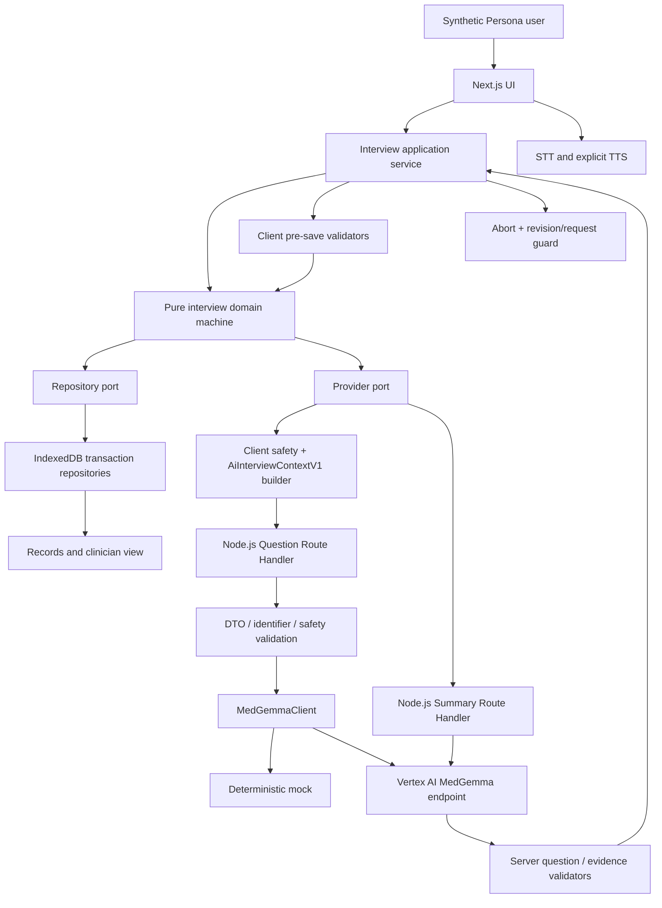
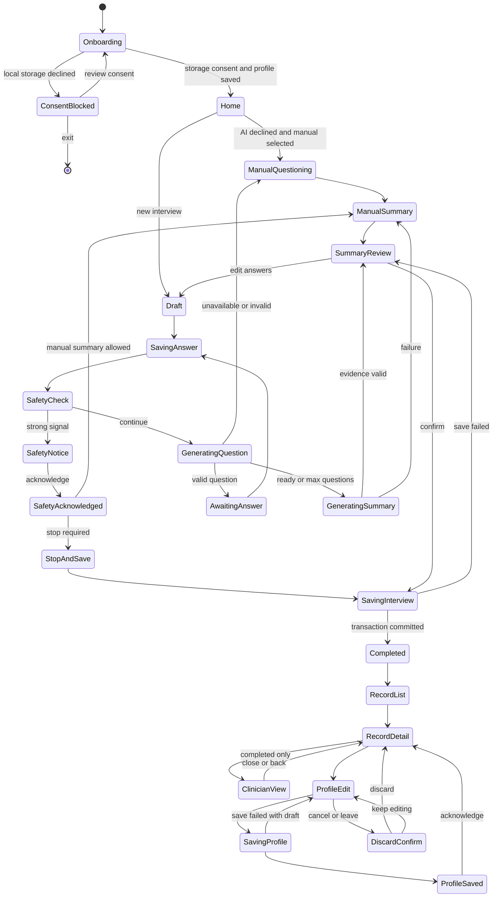

> [상위 문서](../2026-07-16-002-feat-medical-interview-ut-ready-app-plan.md)
> 이전: [성공 기준·범위·출처](./03-scope-and-sources.md)
> 다음: [7일 일정과 위험](./05-schedule-and-risks.md)
## Planning Contract

### Priority Order

1. Next.js 설정, SCSS token, 실제 상태를 표현하는 대표 문진 화면
2. Vertex AI MedGemma 실제 smoke와 mock/actual client 경계
3. IndexedDB, 동의, 기본정보, 텍스트·칩 문진
4. 실제 질문·안전 검증·근거 연결 S/O 요약
5. TTS와 음성 입력
6. 홈·기록·오늘 기록·의료진에게 보여주기
7. 이전 기록·내 정보 수정·전체 삭제
8. Figma·Persona 접근성·오류 회귀
9. 사진은 1~8이 일정 안에 통과한 경우에만 구현

### Key Technical Decisions

- KTD1. 앱 구현을 먼저 완료하고 UT 실행 코드는 만들지 않는다. (session-settled: user-directed — chosen over UT-console-first: 실제 검증 대상 앱이 먼저 필요함)
- KTD2. Next.js App Router, TypeScript, ESLint, `src`, `@/*`, React Compiler를 사용한다. React Compiler는 build 실패 시 제외한다.
- KTD3. SCSS partial과 primitive·semantic·component CSS Custom Properties를 사용하며 BEM 대신 하이픈 class name을 사용한다.
- KTD4. Persona 문서는 런타임에 삽입하지 않는다. 짧은 문장, 한 질문, 큰 조작 영역, 일관된 위치, 낮은 입력 부담을 UI contract와 fixture로 변환한다.
- KTD5. 질문 화면은 `text`, `choice`, `measurement`, `voice`, 조건부 `photo` adapter를 공유한다. 입력 방식 전환은 동일 draft와 answer state를 사용한다.
- KTD6. IndexedDB는 profile, medical profile, interviews, messages, summaries, attachments를 저장한다. 완료 기록은 profile snapshot을 보존한다.
- KTD7. `MedGemmaClient` 아래 mock과 Vertex adapter를 둔다. 일반 E2E는 결정론적 mock, 별도 actual gate는 실제 Vertex endpoint를 사용한다.
- KTD8. MedGemma 요청은 stateless다. 앱이 허용된 현재 state, filled slots, 최근 질문·답변을 매번 다시 구성한다.
- KTD9. 강한 위험 신호는 MedGemma 전에 결정론적으로 검사한다. AI가 생성한 진단·치료·복약 안내는 사용자에게 표시하지 않는다.
- KTD10. 질문은 한 문장·한 의도·쉬운 한국어·최대 길이 validator를 통과해야 한다. 실패하면 1회 재시도 후 승인된 수동 질문으로 전환한다.
- KTD11. S/O 각 항목은 answer/message evidence ID를 포함한다. 존재하지 않는 근거와 원문에 없는 수치·날짜·단위는 저장을 거절한다.
- KTD12. AI 비동의·실패 시 versioned manual question set과 deterministic summary로 완주한다. AI 초안과 수동 결과는 명확히 구분한다.
- KTD13. TTS는 명시적 버튼에서만 실행하고 local `ko-KR` voice를 우선한다. 지원 voice가 없으면 text-only를 유지하며 navigation, `visibilitychange`, `pagehide`, reset에서 취소한다.
- KTD14. 음성 입력은 별도 동의 뒤 지원 브라우저에서만 활성화한다. interim transcript는 저장하지 않고 사용자가 확인한 최종 텍스트만 답변에 반영한다.
- KTD15. 사진 기능은 capture부터 실제 multimodal 응답까지 end-to-end로 검증된 build에서만 feature flag로 노출한다. 저장만 되고 AI가 사용하지 않는 상태는 허용하지 않는다.
- KTD16. 7일 버전은 데스크톱 Chromium 393px와 loopback 단독 실행만 완료 대상으로 한다. 실제 휴대폰·LAN·공개 배포에는 인증, CSRF/origin 검증, rate limit, 비용 상한, 저장 암호화, 접근통제가 포함된 별도 계획이 필요하다.
- KTD17. Vitest와 React Testing Library로 domain·component·Route Handler를, Playwright로 세 핵심 과업과 Persona fixture를 검증한다.
- KTD18. 의존성 방향은 `UI → application service → pure domain machine → repository/provider ports`로 고정한다. 모든 비동기 명령은 `interviewId`, `revision`, `requestId`를 가지며 현재 revision과 일치할 때만 transaction으로 반영한다.
- KTD19. navigation·reset·동의 철회 시 AI·STT 요청을 abort하고 pending operation을 폐기한다. 늦은 응답, 중복 제출, 삭제 후 재생성을 transaction과 revision guard로 차단한다.
- KTD20. Route Handler는 `AiInterviewContextV1` allowlist DTO만 받으며 unknown field·식별정보·body limit 초과를 거절한다. client와 server가 위험 신호를 각각 검사하고, provider 출력은 server 검증 후 client가 저장 직전 다시 검증한다.
- KTD21. 시스템 지시와 사용자 의료 텍스트를 구조적으로 분리하고 사용자 텍스트는 untrusted data로 취급한다. 모델 출력은 HTML·Markdown으로 해석하지 않고 text로만 렌더링한다.
- KTD22. 요약은 `draft → review → saving → completed` 수명주기를 따르며 completed만 clinician view에 노출한다. 오늘 기록은 `Asia/Seoul`, completed 우선, 같은 날 최신순으로 정렬한다.

### High-Level Technical Design





### Output Structure

```text
src/
  app/
    api/ai/question/route.ts
    api/ai/summary/route.ts
    onboarding/page.tsx
    home/page.tsx
    interview/new/page.tsx
    records/page.tsx
    records/[id]/page.tsx
    records/[id]/clinician/page.tsx
    profile/page.tsx
  features/
    onboarding/
    interview/
    inputs/
    summary/
    records/
    profile/
    speech/
  lib/
    ai/
    db/
    privacy/
    safety/
  styles/
tests/
  unit/
  integration/
  e2e/
```

### Environment and Runtime Contract

```text
MEDGEMMA_MODE=mock|vertex
GOOGLE_CLOUD_PROJECT=
GOOGLE_CLOUD_LOCATION=
MEDGEMMA_ENDPOINT_ID=
MEDGEMMA_MODEL_ID=google/medgemma-1.5-4b-it
MEDGEMMA_TIMEOUT_MS=30000
MEDGEMMA_MAX_REQUEST_BYTES=
NEXT_PUBLIC_ENABLE_PHOTO_INPUT=false
```

- 로컬은 Application Default Credentials를 사용하고 credential JSON을 저장소에 두지 않는다.
- 환경 변수와 Google credential은 client bundle, browser log, IndexedDB에 저장하지 않는다.
- package scripts는 개발·production server를 `127.0.0.1`에 bind한다.
- AI Route Handler는 `runtime = 'nodejs'`를 명시한다. project, region, deployed model version, endpoint, request·response schema, payload limit을 Day 1 deployment profile로 동결한다.
- 합성 Persona fixture 외 데이터를 입력하지 않는다. Route Handler는 request/response body를 로그에 남기지 않고 응답을 서버에 저장하지 않는다.
- credential 없는 기본 `test:e2e`는 deterministic mock으로 실행한다. opt-in `test:actual`은 credential이 있는 환경에서 serial로 실행하고 provider/model/latency/validator 결과만 별도 증거로 남긴다.
- mock과 actual 실행 결과를 분리하고 actual 실패를 mock 성공으로 대체하지 않는다.

