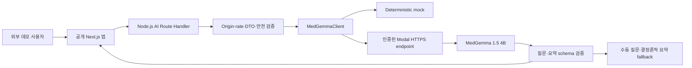

# Modal MedGemma 외부 사용자 데모 설계

- 작성일: 2026-07-20
- 상태: 사용자 승인 완료
- 결정: 외부 사용자 데모의 실제 MedGemma 실행 기반을 Vertex AI에서 Modal로 변경한다.
- 접근 방식: 링크를 아는 누구나 로그인 없이 접근한다.
- 입력 방식: 합성 페르소나 역할극을 전제로 선택형·자유 텍스트·모의 음성 입력을 허용한다.
- 승인일: 2026-07-20
- 적용 시점: 승인된 구현 계획에 따라 활성 구현 계획·체크리스트·환경 계약을 개정한다.

## 1. 목표

외부 사용자가 공개 웹 주소에서 합성 페르소나 역할로 의료 문진 흐름을 체험할 수 있게 한다. Next.js 서버는 Modal에 배포한 `google/medgemma-1.5-4b-it`를 호출하고, 질문 생성과 근거 연결 요약을 기존 안전·검증 계약 안에서 제공한다.

이 데모는 실제 진료 서비스가 아니며 실제 환자, 실제 건강정보, 직접·간접 식별정보 입력을 정책상 허용하지 않는다. 역할극 자유 입력 때문에 실제 정보 오입력을 기술적으로 완전히 차단할 수 없다는 잔여 위험은 별도로 고지한다.

## 2. 범위

### 포함

- 결정론적 mock과 Modal actual provider의 분리
- 공개 Next.js 앱에서 서버 Route Handler를 통한 Modal 호출
- 로그인·초대 코드 없이 링크 기반으로 접근하는 익명 데모
- Modal의 인증된 HTTPS endpoint와 scale-to-zero GPU 실행
- 원본 MedGemma 1.5 4B instruction-tuned 모델 사용
- 합성 페르소나 선택 또는 제공된 가상 시나리오 기반 문진
- 합성 페르소나 역할에 따른 선택형·자유 텍스트 답변
- 마이크를 사용하지 않는 결정론적 모의 음성 입력
- 질문·요약 schema 검증, 재시도, 수동 문진 fallback
- 외부 데모에 필요한 Origin 검증, 요청 제한과 비용 상한
- cold start와 warm response를 분리한 실제 검증

### 제외

- 실제 환자·실제 건강정보·실제 의료기록 입력
- 이름만 삭제한 실제 기록 또는 가명정보 사용
- 실제 사진, 검사 결과, 처방전과 의료 문서 업로드
- 실제 마이크 권한, 음성 녹음, STT provider 호출과 오디오 전송
- Modal Enterprise BAA가 필요한 PHI 처리
- 진단, 치료, 복약 지시 제공
- 운영 의료 서비스의 SLA, 감사, 장기 보존과 재해 복구
- 공개 Next.js 호스팅 사업자 선정과 운영 계약
- 사용자 계정, 로그인, 초대 코드와 사용자별 장기 이용 기록

## 3. 데이터 경계

데모 데이터는 실제 사람에게서 유래하지 않은 합성 데이터만 허용한다. 현재 Persona fixture와 동일하게 이름, 나이, 증상, 기간, 측정값, 복용약과 과거력 전체를 가상으로 작성한다.

외부 사용자는 자신의 실제 상태를 입력하는 대신 선택한 합성 페르소나 역할로 답한다. 선택형과 자유 텍스트 입력을 허용하며, 시작 화면과 자유 입력 주변에 실제 개인정보·건강정보를 입력하지 말라는 안내를 표시한다.

링크를 아는 누구나 접근할 수 있으므로 URL 자체를 인증이나 비밀로 취급하지 않는다. 역할극 자유 입력에서는 사용자의 실제 정보 입력을 안내와 금지 필드 검사만으로 완전히 방지할 수 없다는 한계가 있다. 따라서 이 설계의 합성 데이터 경계는 사용자 정책과 예방 통제이며 기술적으로 완전한 보장이 아니다.

새 문진을 시작할 때 사용자는 다음 내용을 확인해야 한다.

- 선택한 가상 인물의 입장에서만 답한다.
- 자신의 실제 증상·병력·개인정보를 입력하지 않는다.
- 실제 정보가 포함된 경우 전송하지 않고 내용을 지운다.

client와 server는 전화번호, 이메일, 주민등록번호 형식과 명시적인 주소·기관·실명 입력을 각각 검사한다. 직접 식별정보가 의심되면 Modal에 보내지 않고 수정 안내를 표시한다. 이 검사는 실제 건강정보 여부를 판별하거나 모든 간접 식별정보를 제거하는 수단으로 간주하지 않는다.

다음 항목은 입력·전송을 금지한다.

- 실명, 연락처, 주소, 주민등록번호, 환자번호
- 실제 생년월일, 병원명, 학교·직장명과 위치
- 실제 건강 상태를 설명하는 자유 서술
- 실제 사진, 음성 원본, 영상과 의료 문서
- 다른 정보와 결합해 특정 개인을 알아볼 수 있는 희귀 사건 조합

Route Handler는 `AiInterviewContextV1` allowlist만 허용하고 금지 필드, unknown field와 크기 제한 초과 요청을 거절한다. Next.js와 Modal 애플리케이션 로그에 요청·응답 본문을 남기지 않는다.

## 4. 모의 음성 입력 계약

음성 입력은 실제 STT가 아니라 합성 페르소나 답변을 입력하는 데모 상호작용이다. 브라우저의 마이크 권한을 요청하지 않고 `MediaDevices`, `MediaRecorder`, `SpeechRecognition`과 외부 음성 provider를 호출하지 않는다.

사용자가 음성 입력 버튼을 누르면 `듣고 있어요`와 `말씀을 글자로 바꾸고 있어요` 상태를 결정론적으로 표시한 뒤, 현재 질문의 승인 slot과 합성 페르소나에 대응하는 fixture 답변을 transcript에 채운다. 사용자는 transcript를 확인·수정하고 명시적인 `다음`을 눌러 제출한다.

질문 schema는 모의 답변을 찾을 수 있는 승인 slot을 포함한다. 알 수 없는 slot이거나 fixture 답변이 없으면 transcript를 만들지 않고 텍스트·선택형 입력으로 전환한다. 버튼과 상태에는 실제 녹음이 아닌 데모 기능이라는 접근 가능한 설명을 제공한다.

## 5. 아키텍처

브라우저는 Modal을 직접 호출하지 않는다. Modal proxy 인증정보는 Next.js server-only 환경에서 관리한다. Hugging Face token은 Modal image build 전용 `medgemma-hf` Secret에만 두며, 모델을 image에 내려받은 뒤 실제 질문·요약 요청에는 전달하지 않는다. 어떤 credential도 client bundle, 브라우저 로그와 IndexedDB에 저장하지 않는다.

공개 웹 호스팅은 Modal 추론 배포와 분리한다. 2026-07-24 데모 호스팅은 Vinext와 Cloudflare Worker 호환 경로를 사용하는 OpenAI Sites로 확정했으며, 소유자 전용 mock 배포를 먼저 검증한다. 외부 공개와 실제 Modal 연결은 각각 별도 승인과 운영 검증을 거친다.

## 6. Provider 계약

`MedGemmaClient` 아래 다음 adapter를 둔다.

- `MockMedGemmaAdapter`: credential 없이 모든 단위·통합·일반 E2E를 결정론적으로 실행한다.
- `ModalMedGemmaAdapter`: opt-in actual gate와 외부 데모에서 인증된 Modal endpoint를 호출한다.

Provider 요청은 stateless로 유지한다. 매 요청은 허용된 현재 문진 state, 채워진 slot과 필요한 최근 질문·답변만 재구성한다. 질문 수는 상황에 따라 달라지므로 단계 번호나 고정 총 질문 수를 모델 출력과 UI에 넣지 않는다.

Modal 요청과 응답은 versioned JSON schema를 사용한다. Provider 출력은 서버에서 검증하고 client 저장 직전에 다시 검증한다. HTML과 Markdown으로 해석하지 않고 text로만 렌더링한다.

## 7. Modal 실행·보안·검증 계약

Modal 배포, 공개 익명 데모 보안, cold start, 비용과 검증의 상세 계약은 [Modal 런타임·보안·검증](./2026-07-20-modal-medgemma-external-demo-design/01-modal-runtime-security-verification.md)을 따른다.

핵심 경계는 T4 1개부터 시작하는 scale-to-zero, 인증된 endpoint, 최대 컨테이너 1개, GPU generation 60초 제한, Next provider 기본 75초·허용 상한 180초, 1회 제한 재시도와 수동 문진 fallback이다. 공개 링크는 인증 수단이 아니므로 익명 session·Origin·rate limit·전체 일일 상한과 server-side kill switch를 사용한다.

## 8. 문서 변경 범위

이 문서 승인 후 다음 자료를 Modal 기준으로 개정한다.

- `docs/README.md`의 현재 구현 기준과 문서 권위
- 2026-07-16 실행 계획의 목표, 범위, KTD7·KTD16, 아키텍처와 환경 계약
- 구현 체크리스트의 Vertex gate, 공개 데모 보안 gate와 검증 항목
- `.env.example`의 provider·Modal·Hugging Face 변수 이름
- 작업일지의 결정, 미완료 항목과 다음 작업

기존 Vertex 결정은 삭제하지 않고 변경 이력으로 남긴다. Modal actual 성공을 mock 성공으로 대체하지 않으며, 외부 공개 성공도 localhost E2E 성공으로 대체하지 않는다.

## 9. 승인 기준

다음 문장이 모두 참이면 이 설계를 승인한다.

- 외부 사용자는 실제 정보가 아닌 합성 페르소나 역할로만 데모한다.
- 사용자는 역할극 자유 텍스트를 입력할 수 있으며 실제 정보 오입력을 완전히 막을 수 없다는 잔여 위험을 승인한다.
- 음성 입력은 실제 마이크·녹음·STT 없이 합성 fixture transcript를 제공하는 모의 기능이다.
- Modal은 MedGemma inference만 담당하고 브라우저는 Next.js 서버를 통해 호출한다.
- 실제 건강정보·식별정보 입력은 기술·안내 양쪽에서 금지한다.
- 비용을 위해 scale-to-zero와 단일 컨테이너를 사용한다.
- cold start나 provider 오류가 있어도 수동 문진으로 완주한다.
- 실제 의료정보를 처리하려면 별도 보안·법률 설계와 승인을 다시 받는다.
